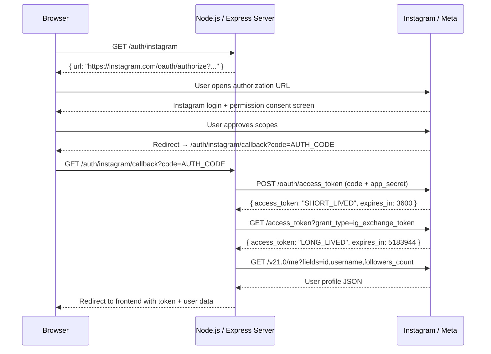
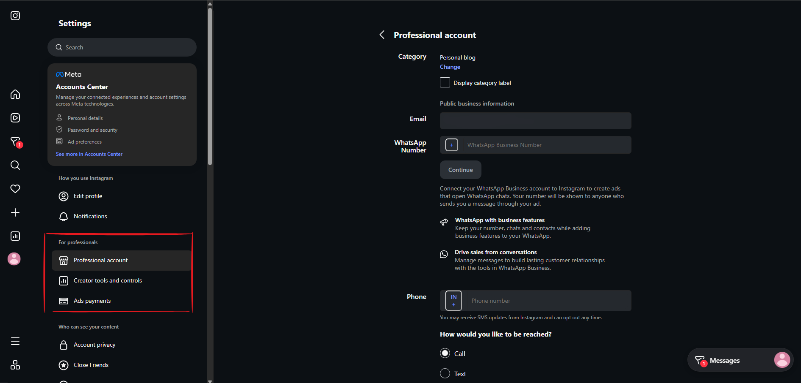
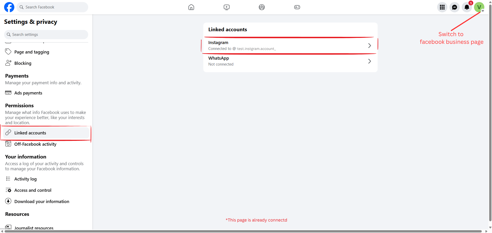
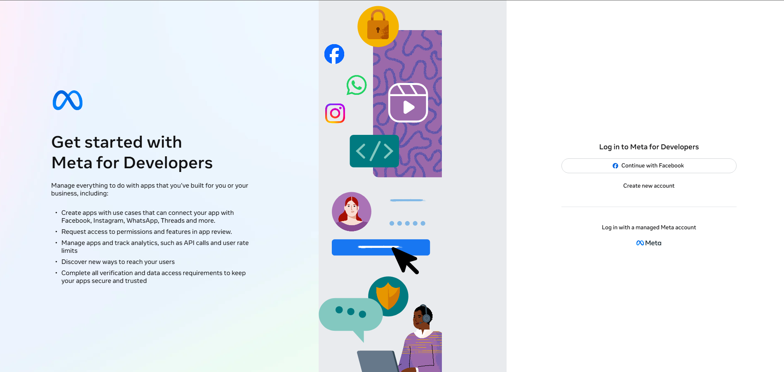
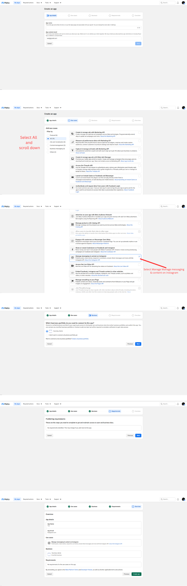
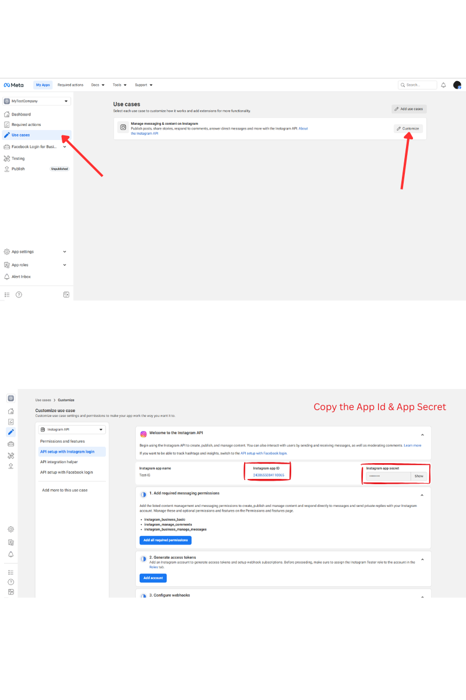
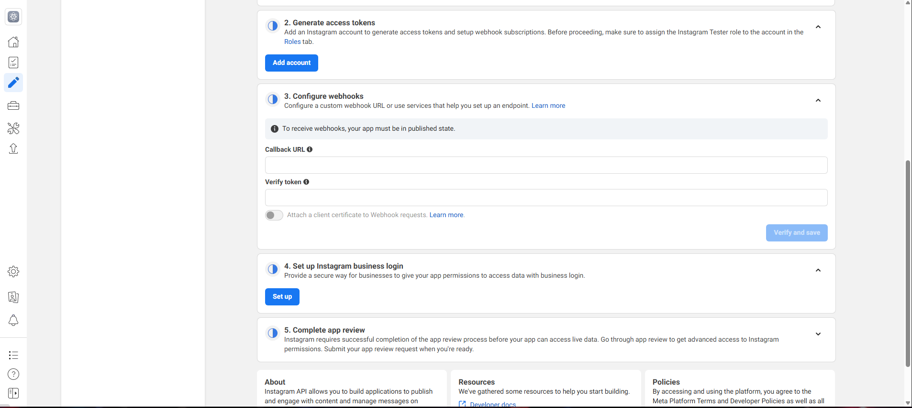
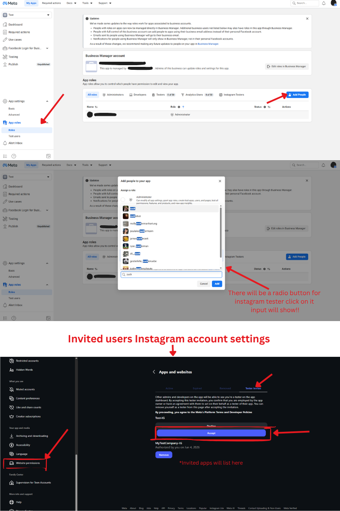
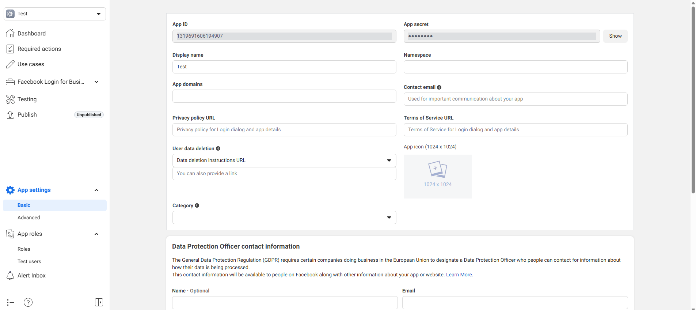

# Instagram OAuth 2.0 with Node.js

<!-- SEO keywords: instagram oauth nodejs | meta instagram oauth node.js 2026 | instagram login node.js express | instagram graph api nodejs | meta instagram api node.js latest | instagram oauth 2.0 tutorial | instagram business api node.js | instagram graph api access token node.js -->

<p align="center">
  
  
  
  
</p>

<p align="center">
  <b>The most complete, up-to-date guide for Instagram OAuth 2.0 with Node.js updated for 2026.</b><br/>
  Full OAuth flow &nbsp;·&nbsp; Short & long-lived token exchange &nbsp;·&nbsp; Graph API &nbsp;·&nbsp; Media & Insights &nbsp;·&nbsp; Deployment checklist
</p>

<p align="center">
  <a href="#-quick-start">⚡ Quick Start</a> ·
  <a href="#step-4-implement-oauth-flow-in-nodejs">🔐 OAuth Flow</a> ·
  <a href="#-api-reference">📡 API Reference</a> ·
  <a href="#-scopes-and-app-review">🔑 Scopes</a> ·
  <a href="./TROUBLESHOOTING.md">🐛 Troubleshooting</a>
</p>

---

> [!CAUTION]
> **The old Instagram Basic Display API was permanently removed in December 2024.**
> This guide uses the **Instagram API with Instagram Login** — the only supported method as of 2025/2026.
> If you are still using `graph.facebook.com/me/accounts` or the Basic Display API, **you need to migrate**. This repo shows you exactly how.

---

## OAuth 2.0 Flow Overview



---

## Why This Repo?

The official Meta documentation is fragmented across multiple pages and frequently out of date. This repo consolidates everything into a single, working, production-tested reference:

- ✅ **2026-current** — uses Instagram Graph API `v21.0` and the new Instagram Login flow
- ✅ **No Facebook Login required** — `enable_fb_login=0` forces pure Instagram authentication
- ✅ **Business & Creator accounts** — covers all non-personal account types
- ✅ **Full flow** — authorization URL → code exchange → short-lived token → long-lived token → Graph API
- ✅ **Insights included** — post-level and account-level metrics with the correct 2024/2025 metric names
- ✅ **Screenshots included** — every Meta dashboard step is shown visually
- ✅ **Common errors documented** — 8+ real errors with exact fix instructions

---

## What Changed in 2025–2026

> [!IMPORTANT]
> Older tutorials (pre-2025) are outdated. Here's what has changed — this is the most common source of broken integrations.

| What | Before (2023–2024) | Now (2025/2026) |
|------|--------------------|-----------------|
| **Basic Display API** | Available | ❌ Removed December 2024 |
| **Auth URL** | `https://api.instagram.com/oauth/authorize` | `https://www.instagram.com/oauth/authorize` |
| **FB Login toggle** | Not present | `enable_fb_login=0` required for Instagram-only login |
| **Profile endpoint** | `GET /{user_id}` | `GET /me` only — using `/{user_id}` causes error code 100 |
| **`impressions` metric** | Account-level insights | ❌ Removed — replace with `total_interactions` |
| **Personal accounts** | Partially supported via Basic Display | ❌ Business / Creator accounts only |
| **API version** | v17.0 / v18.0 | **v21.0** (current stable) |

---

## Table of Contents

- [Instagram OAuth 2.0 with Node.js](#instagram-oauth-20-with-nodejs)
  - [OAuth 2.0 Flow Overview](#oauth-20-flow-overview)
  - [Why This Repo?](#why-this-repo)
  - [What Changed in 2025–2026](#what-changed-in-20252026)
  - [Table of Contents](#table-of-contents)
  - [⚡ Quick Start](#-quick-start)
  - [Prerequisites](#prerequisites)
  - [Step 0: Set Up Your Instagram \& Facebook Accounts](#step-0-set-up-your-instagram--facebook-accounts)
    - [1. Create or convert an Instagram Business or Creator account](#1-create-or-convert-an-instagram-business-or-creator-account)
    - [2. Link your Instagram account to a Facebook Page](#2-link-your-instagram-account-to-a-facebook-page)
    - [3. Create a Meta Developer account](#3-create-a-meta-developer-account)
  - [Step 1: Create a Meta App](#step-1-create-a-meta-app)
  - [Step 2: Configure OAuth Redirect URI](#step-2-configure-oauth-redirect-uri)
  - [Step 3: Add Instagram Testers for Local Testing](#step-3-add-instagram-testers-for-local-testing)
  - [Step 4: Implement OAuth Flow in Node.js](#step-4-implement-oauth-flow-in-nodejs)
  - [Step 5: Exchange Code for Access Token](#step-5-exchange-code-for-access-token)
  - [Step 6: Make a Graph API Call](#step-6-make-a-graph-api-call)
  - [Step 7: Going Live — Deployment Checklist](#step-7-going-live--deployment-checklist)
  - [Environment Variables](#environment-variables)
  - [Project Structure](#project-structure)
  - [📡 API Reference](#-api-reference)
  - [🔑 Scopes and App Review](#-scopes-and-app-review)
  - [Troubleshooting](#troubleshooting)
  - [References](#references)
  - [🙌 Contributing \& Support](#-contributing--support)

---

## ⚡ Quick Start

```bash
# 1. Clone the repo
git clone https://github.com/your-username/instagram-oauth-nodejs.git
cd instagram-oauth-nodejs

# 2. Install dependencies
npm install

# 3. Configure environment variables
cp .env.example .env
# → Fill in IG_APP_ID, IG_APP_SECRET, REDIRECT_URI, FRONTEND_URL

# 4. Start local tunnel (Instagram requires HTTPS — localhost is rejected)
ngrok http 4000

# 5. Run the server
npm run dev
```

Then visit `GET /auth/instagram` → copy the returned URL → open in browser → authorize → get your token.

> [!TIP]
> Use [ngrok](https://ngrok.com) to expose `localhost:4000` over HTTPS. Instagram **rejects** plain `localhost` redirect URIs — this is the #1 setup mistake.

---

## Prerequisites

| Requirement | Notes |
|---|---|
| **Node.js v18+** | Check with `node -v` |
| **Meta Developer account** | [developers.facebook.com](https://developers.facebook.com) |
| **Instagram Business or Creator account** | Personal accounts are **not** supported by the Instagram Graph API |
| **HTTPS redirect URI** | `localhost` is rejected — use [ngrok](https://ngrok.com) for local dev |

```bash
npm install express axios cors dotenv
```

---

## Step 0: Set Up Your Instagram & Facebook Accounts

Before creating a Meta app, make sure your accounts meet Instagram's API requirements.

### 1. Create or convert an Instagram Business or Creator account

The Instagram Graph API does **not** work with personal Instagram accounts. You must use a **Business** or **Creator** account.

1. Open the Instagram app → go to your profile → tap the hamburger menu (☰) → **Settings and privacy**.
2. Tap **Account type and tools** → **Switch to Professional Account**.
3. Choose **Business** (recommended for API access) or **Creator**.
4. Follow the prompts to complete setup.

> [!NOTE]
> If you already have a Business or Creator account, skip this step.

### 2. Link your Instagram account to a Facebook Page

Meta requires your Instagram account to be connected to a Facebook Page to use the Instagram Graph API.

1. Go to [facebook.com](https://www.facebook.com) and log in (or create an account).
2. Create a Facebook Page if you don't have one: **Pages** → **Create new Page**.
3. In the Instagram app → **Settings and privacy** → **Account** → **Linked accounts** → **Facebook** → follow the prompts to connect your Page.

Alternatively, from your Facebook Page:
- **Settings** → **Linked accounts** (or **Instagram**) → **Connect account**.



> [!WARNING]
> Without a linked Facebook Page, the Meta Developer portal will not let you configure Instagram API access.

### 3. Create a Meta Developer account

1. Go to [developers.facebook.com](https://developers.facebook.com).
2. Click **Get Started** and log in with your Facebook account.
3. Verify your account via phone number if prompted.
4. Accept the Meta Platform Policies.

Once your developer account is active and your Instagram Business/Creator account is linked to a Facebook Page, proceed to Step 1.


---

## Step 1: Create a Meta App

1. Go to [developers.facebook.com](https://developers.facebook.com) → **My Apps** → **Create App**.

1. In the left sidebar **Use cases** → **Customize**, click **API setup with Instagram login**.

2. Note your **Instagram App ID** and **Instagram App Secret** from this page.



> [!WARNING]
> The **Instagram App ID** is different from the **Facebook App ID** shown at the top of the page. Using the wrong one is the most common cause of the `Invalid platform app` error.

---

## Step 2: Configure OAuth Redirect URI

1. On the **API setup with Instagram login** page, scroll to **Step 4: Set up Instagram business login** → click **Set up**.
2. Enter your redirect URI:
   - **Production:** `https://yourdomain.com/auth/instagram/callback`
   - **Local dev:** use ngrok → `https://xxxx.ngrok-free.app/auth/instagram/callback`

> [!CAUTION]
> `localhost` is rejected by Meta. You **must** use an HTTPS URL. Use ngrok for local development.

   
   
3. Click **Save**.

**ngrok setup for local development:**

```bash
# Install ngrok
winget install ngrok.ngrok   # Windows
brew install ngrok            # macOS

# Authenticate (one-time)
ngrok config add-authtoken <your_token>

# Start tunnel
ngrok http 4000
# → Forwarding: https://xxxx.ngrok-free.app → http://localhost:4000
```

Use the `https://xxxx.ngrok-free.app` URL as your redirect URI.

---

## Step 3: Add Instagram Testers for Local Testing

While your app is in **development mode**, only explicitly added Instagram accounts can go through the OAuth flow. To allow an account to test:

1. Go to your app in the [Meta Developer Dashboard](https://developers.facebook.com).
2. In the left sidebar, navigate to **App Roles** → **Roles**.
3. Under **Instagram Testers**, click **Add Instagram Testers** and enter the Instagram username you want to test with.
4. The invited user must accept the invite have them open the Instagram app and go to their profile.
5. Go to **Settings** → **Website Permissions** → **Apps and Websites** → **Tester Invites** → tap **Accept**.
      

> [!NOTE]
> In development mode, only accounts explicitly added as Instagram Testers can complete the OAuth flow. All other accounts will be blocked. See [Step 7](#step-7-going-live--deployment-checklist) to go live.

---

## Step 4: Implement OAuth Flow in Node.js

The authorization flow has two steps:

1. **Redirect** the user to Instagram's authorization page with your app credentials and requested scopes.
2. **Handle the callback** where Instagram redirects back with a `?code=` query parameter.

```js
// src/auth.js
const express = require("express");
const router = express.Router();

const { IG_APP_ID, REDIRECT_URI } = process.env;

// Step 1: Generate and return the Instagram authorization URL
router.get("/instagram", (req, res) => {
  const url =
    `https://www.instagram.com/oauth/authorize` +
    `?client_id=${IG_APP_ID}` +
    `&redirect_uri=${encodeURIComponent(REDIRECT_URI)}` +
    `&scope=instagram_business_basic,instagram_business_manage_insights` +
    `&response_type=code` +
    `&enable_fb_login=0` +
    `&force_authentication=1`;

  res.json({ url });
});
```

> [!NOTE]
> **`enable_fb_login=0`** forces Instagram-only login instead of Facebook login. This parameter is required for the Instagram API with Instagram Login flow — without it, users see a Facebook login prompt.

---

## Step 5: Exchange Code for Access Token

When Instagram redirects to your callback URL with `?code=...`, POST the code to Instagram's token endpoint:

```js
// src/auth.js (continued)
const axios = require("axios");

router.get("/instagram/callback", async (req, res) => {
  const { code } = req.query;
  if (!code)
    return res.status(400).json({ error: "No authorization code received" });

  try {
    const params = new URLSearchParams();
    params.append("client_id", process.env.IG_APP_ID);
    params.append("client_secret", process.env.IG_APP_SECRET);
    params.append("grant_type", "authorization_code");
    params.append("redirect_uri", process.env.REDIRECT_URI);
    params.append("code", code);

    const tokenRes = await axios.post(
      "https://api.instagram.com/oauth/access_token",
      params,
    );

    const { access_token } = tokenRes.data;

    // Redirect to frontend with token
    res.redirect(`${process.env.FRONTEND_URL}/callback?token=${access_token}`);
  } catch (err) {
    res.redirect(
      `${process.env.FRONTEND_URL}/callback?error=${encodeURIComponent(
        JSON.stringify(err.response?.data || err.message),
      )}`,
    );
  }
});
```

> [!IMPORTANT]
> The code exchange returns a **short-lived token valid for only 1 hour**. Always exchange it for a **long-lived token (60 days)** before returning anything to the frontend:

```js
// Exchange short-lived → long-lived token (do this server-side, never expose app secret)
const longLivedRes = await axios.get(
  `https://graph.instagram.com/access_token` +
  `?grant_type=ig_exchange_token` +
  `&client_secret=${process.env.IG_APP_SECRET}` +
  `&access_token=${access_token}`
);
const longLivedToken = longLivedRes.data.access_token;
// expires_in: ~5183944 seconds (≈ 60 days)
```
>
> Long-lived tokens can be refreshed before expiry via `GET /refresh_access_token?grant_type=ig_refresh_token&access_token=<long_lived_token>`.

---

## Step 6: Make a Graph API Call

With a valid `access_token`, call the Instagram Graph API using `/me` (not `/{user_id}`):

```js
// src/api.js
const axios = require("axios");
const BASE = "https://graph.instagram.com/v21.0";

// Fetch user profile
const getProfile = async (token) => {
  const r = await axios.get(
    `${BASE}/me?fields=id,username,account_type,followers_count,media_count,profile_picture_url&access_token=${token}`,
  );
  return r.data;
};

// Fetch recent media
const getMedia = async (token) => {
  const r = await axios.get(
    `${BASE}/me/media?fields=id,caption,media_type,timestamp,like_count,comments_count,media_url&limit=12&access_token=${token}`,
  );
  return r.data;
};

// Fetch 30-day account reach
const getAccountInsights = async (token) => {
  const since = Math.floor(Date.now() / 1000) - 2592000;
  const until = Math.floor(Date.now() / 1000);
  const r = await axios.get(
    `${BASE}/me/insights?metric=reach&period=day&since=${since}&until=${until}&access_token=${token}`,
  );
  return r.data;
};
```

---

## Step 7: Going Live — Deployment Checklist

Before switching your app from **development mode** to **live**, complete the following in the [Meta Developer Dashboard](https://developers.facebook.com):

1. **Create a Privacy Policy page** for your project — it must be a publicly accessible, well-structured HTTPS URL (e.g. `https://yourdomain.com/privacy-policy`).
2. **Create a Terms and Conditions page** — similarly, a public HTTPS URL (e.g. `https://yourdomain.com/terms`).
3. Go to **App Settings** → **Basic** and fill in the required fields:
   - **Privacy Policy URL** — paste your privacy policy link.
   - **Terms of Service URL** — paste your terms and conditions link.
   - **App Icon** — upload a square icon (1024×1024 px recommended).
   - **App Domain** — your production domain (e.g. `yourdomain.com`).
   - **Category** — choose the most relevant category for your app.
   - Fill in any other required fields marked with an asterisk.
   - Switch your app to **Live mode** (Button will show when you enter all required fields).
4. Click **Save Changes**.
       


> **Note:** After submitting, Meta typically reviews and verifies your app within a few days. Once approved, any Instagram user (not just added testers) will be able to authenticate through your app.

---

## Environment Variables

Copy `.env.example` to `.env` and fill in your values:

```env
IG_APP_ID=your_instagram_app_id
IG_APP_SECRET=your_instagram_app_secret
REDIRECT_URI=https://yourdomain.com/auth/instagram/callback
FRONTEND_URL=http://localhost:3000
PORT=4000
```

> [!WARNING]
> Never commit `.env` to source control — it contains your `IG_APP_SECRET`. Add `.env` to `.gitignore` immediately.

---

## Project Structure

```
instagram-oauth-nodejs/
├── README.md
├── TROUBLESHOOTING.md
├── assets/
│   └── screenshots/
├── src/
│   ├── auth.js          ← OAuth redirect + callback + token exchange
│   └── api.js           ← Graph API calls: profile, media, insights
├── .env.example
└── package.json
```

**Entry point (`index.js`):**

```js
const express = require("express");
const cors = require("cors");
require("dotenv").config();

const authRouter = require("./src/auth");
const apiRouter = require("./src/api");

const app = express();
app.use(cors({ origin: process.env.FRONTEND_URL, credentials: true }));
app.use(express.json());

app.use("/auth", authRouter);
app.use("/instagram", apiRouter);

app.listen(process.env.PORT || 4000, () =>
  console.log(`Server on :${process.env.PORT || 4000}`),
);
```

---

## 📡 API Reference

| Method | Endpoint                               | Scope Required                       | Description                                  |
| ------ | -------------------------------------- | ------------------------------------ | -------------------------------------------- |
| GET    | `/auth/instagram`                      | —                                    | Returns Instagram authorization URL          |
| GET    | `/auth/instagram/callback`             | —                                    | Handles code exchange, redirects to frontend |
| GET    | `/instagram/profile?token=`            | `instagram_business_basic`           | Profile + followers count                    |
| GET    | `/instagram/media?token=`              | `instagram_business_basic`           | Last 12 posts with likes/comments            |
| GET    | `/instagram/media/:id?token=`          | `instagram_business_basic`           | Single post detail                           |
| GET    | `/instagram/media/:id/insights?token=` | `instagram_business_manage_insights` | Post reach, saves, shares                    |
| GET    | `/instagram/account-insights?token=`   | `instagram_business_manage_insights` | 30-day account reach + interactions          |

---

## 🔑 Scopes and App Review

| Scope                                | Available Without Review | What It Unlocks                                  |
| ------------------------------------ | ------------------------ | ------------------------------------------------ |
| `instagram_business_basic`           | ✅ Yes                   | Profile, followers, media, likes, comments       |
| `instagram_business_manage_insights` | ⚠️ App admin only        | Reach, impressions, saves, shares, profile views |
| `instagram_business_content_publish` | ⚠️ App Review required   | Publishing posts via API                         |
| `instagram_business_manage_messages` | ⚠️ App Review required   | DM inbox access                                  |

**To submit App Review:**
Meta Dashboard → **App Review** → **Permissions and Features** → find the scope → **Request** → attach screencast + use case description.

Review takes approximately 5 business days.

> **Adding testers (development mode):** Meta Dashboard → **App Roles** → **Roles** → **Instagram Testers** → add IG username. The user accepts the invite in Instagram → Settings → Apps and Websites → Tester Invites.

---

## Troubleshooting

> [!TIP]
> Full step-by-step fix instructions for every error below are in [TROUBLESHOOTING.md](./TROUBLESHOOTING.md).

| Error Message | Root Cause | Quick Fix |
|---------------|-----------|----------|
| `Invalid Request: Invalid platform app` | Using **Facebook App ID** instead of **Instagram App ID** | Copy the Instagram App ID from the Instagram API setup page, not Basic Settings |
| `Application does not have permission` (code 10) | Scope not approved via App Review | Submit App Review, or use app admin account in dev mode |
| `callback URL couldn't be validated` | Redirect URI entered in **Webhooks** section | Enter URI under **Step 4 → Set up Instagram business login** instead |
| `Error saving redirect URIs` | `localhost` used as redirect URI | Replace with ngrok HTTPS URL |
| `metric[1] must be one of the following values` | Requesting removed metric (`impressions`) | Replace `impressions` with `total_interactions` |
| `Object with ID 'xxx' does not exist` (code 100/33) | Using `/{user_id}` endpoint | Switch to `/me` endpoint |
| `ngrok-agent version is too old` | npm `ngrok` package is a deprecated wrapper | Install real ngrok binary: `winget install ngrok.ngrok` |
| `Insufficient Developer Role` | Account not added as Instagram Tester | Meta Dashboard → App Roles → Instagram Testers → add username |

---

## References

| Resource | Description |
|----------|-------------|
| [Instagram API with Instagram Login](https://developers.facebook.com/docs/instagram/platform/instagram-api/) | Official Meta docs — the canonical reference for the current auth flow |
| [Instagram Graph API — Getting Started](https://developers.facebook.com/docs/instagram-platform/getting-started) | Step-by-step setup guide from Meta |
| [Instagram Graph API — Insights](https://developers.facebook.com/docs/instagram-platform/reference/ig-media/insights) | Valid metrics, periods, and breakdowns for media and account insights |
| [OAuth 2.0 Authorization Code Flow](https://developers.facebook.com/docs/instagram/platform/instagram-api/authentication) | Full auth flow reference including token exchange endpoints |
| [Meta App Review](https://developers.facebook.com/docs/app-review) | How to request additional scopes (`manage_insights`, `content_publish`, etc.) |
| [ngrok Documentation](https://ngrok.com/docs) | HTTPS tunneling for local development |

---

## 🙌 Contributing & Support

If this repo saved you hours of digging through fragmented Meta docs, please consider giving it a **⭐ star** — it helps other developers find it when they search for:

> *Instagram OAuth Node.js* · *Meta Instagram OAuth Node.js 2026* · *Instagram Login Express* · *Instagram Graph API token Node.js* · *Instagram API with Instagram Login Node.js*

Found a bug or spotted a Meta API change? [Open an issue](../../issues) or submit a PR — all contributions are welcome.

**Recommended GitHub Topics for this repo:**
`instagram` · `oauth` · `oauth2` · `nodejs` · `expressjs` · `instagram-api` · `meta-api` · `instagram-oauth` · `graph-api` · `instagram-login`

---

<p align="center">
  <sub>Built for developers who just want Instagram OAuth to <b>work</b> — without reading 12 different Meta docs pages.</sub>
</p>
